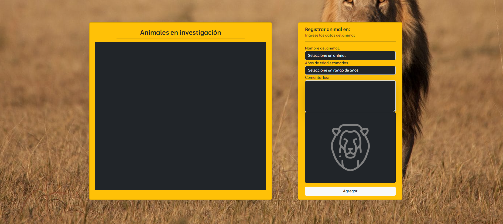
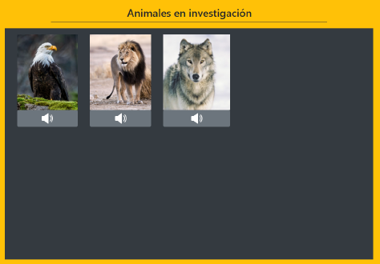
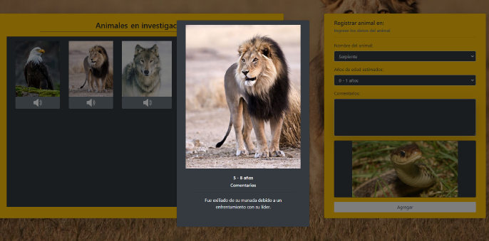

# **COMMENTS REGISTRATION ABOUT ANIMALS**

## Description
This web application allows adding animals under research to a table, using the OOP paradigm to create instances representing different animals with their attributes and methods.

## Technologies Used
HTML5, CSS3, JavaScript, JSON, Bootstrap 5

## Features
1. **Animal management:** The presence of files such as Animal.js, Aguila.js, Leon.js, Lobo.js, Oso.js, and Serpiente.js suggests that the application manages different types of animals, possibly with classes or specific modules for each species.
2. **Interactive form:** The AnimalForm.js file indicates that the application includes a form to register or manage animals.
3. **Preview:** The Preview.js file suggests that users can preview animals or entered data before confirming any changes.
4. **Main logic:** The main.js file probably manages the core logic of the application, such as event initialization and integrating different functionalities.
5. **Multimedia:**
    - **The sounds folder:** suggests that the application incorporates sounds, possibly related to animals for a more interactive experience.
    - **The img folder:** indicates that it also uses images, probably to visually represent the animals.
6. **Custom styles:** The css folder contains custom styles, which may include a design adapted to the theme of wild animals.

## Expected Features
  - **Animal registration and management:** Ability to add or view information about different animals.
  - **Interactive preview:** View information or characteristics of animals.
  - **Multimedia interactivity:** Sounds and images to make the application more engaging.
  - **Responsive design:** Use of Bootstrap to ensure the application looks good on different devices.

## Notes
Before opening the application in your browser, use Node.js and the http-server package. If you have Node.js installed, run the following commands:
1. Install the http-server package globally using Node.js:
   ```bash
   npm install -g http-server
2. Start the server:
   ```bash
   http-server
2. Open the application in your browser at:
   ```bash
   http://127.0.0.1:8080/


## Screenshots
<p align="center">
  
</p>

<p align="center">
  
</p>

<p align="center">
  
</p>

## Installation
1. Clone the repository
   ```bash
   git clone  https://github.com/yadicep/animal_registration.git
